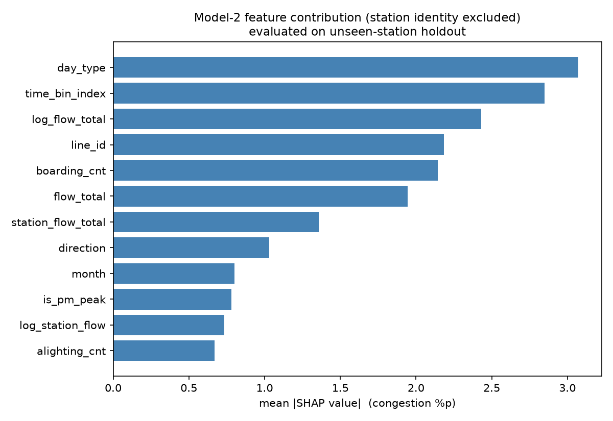

# Model B 평가 리포트 (표준 지표 재구성)

08 의 판정(**baseline 채택, LightGBM 폐기**)은 그대로다. 이 문서는 그 판정이 어느 정도로 견고한지를 표준 지표로 정량화한다.

## 1. Baseline ladder

어느 수준의 정보가 얼마나 기여하는지 계단으로 확인한다.

| level           | regime         |     MAE |    RMSE |       R2 |   coverage |   pr_auc |   recall_at_p50 |   base_rate |
|:----------------|:---------------|--------:|--------:|---------:|-----------:|---------:|----------------:|------------:|
| L0 전체평균         | A. 시간축 valid   |  15.342 |  19.878 |  -0      |     1      |   0.0558 |          0      |      0.0566 |
| L1 노선x방향x요일x시간대 | A. 시간축 valid   |  11.115 |  15.401 |   0.3997 |     1      |   0.1344 |          0      |      0.0566 |
| L2 역x방향x요일x시간대  | A. 시간축 valid   |   2.364 |   4.575 |   0.947  |     0.9997 |   0.857  |          0.8923 |      0.0566 |
| L3 L2+최근스냅샷     | A. 시간축 valid   |   2.763 |   5.327 |   0.9282 |     0.9997 |   0.8468 |          0.9124 |      0.0566 |
| L0 전체평균         | B. 미관측 역 valid |  15.148 |  19.502 |  -0      |     1      |   0.0586 |          0      |      0.0601 |
| L1 노선x방향x요일x시간대 | B. 미관측 역 valid |  11.019 |  15.088 |   0.4014 |     1      |   0.1593 |          0.0101 |      0.0601 |
| L2 역x방향x요일x시간대  | B. 미관측 역 valid | nan     | nan     | nan      |     0      | nan      |        nan      |    nan      |
| L3 L2+최근스냅샷     | B. 미관측 역 valid | nan     | nan     | nan      |     0      | nan      |        nan      |    nan      |

- 사전 등록한 비교 대상은 **L2 (역x방향x요일x시간대 평균)** 이다.
- Regime B(미관측 역)에서 L2 는 coverage 0 이다. 학습에 없던 역은 값 자체를 만들 수 없다. 그래서 L1(노선 단위)이 실질 비교 대상이 된다.

## 2. Skill Score

MASE 는 시계열 naive forecast 를 분모로 쓰는 지표라 격자 회귀인 이 문제에 맞지 않는다. 정의가 정확한 Skill Score 를 쓴다.

```
Skill Score = 1 - MAE_model / MAE_reference   (양수면 개선)
```

| Regime | 모델 | 기준 baseline | Skill Score |
|---|---|---|---|
| A. 시간축 valid | LGBM 전체 피처 | L2 (MAE 2.364) | **-0.464** |
| B. 미관측 역 | LGBM 역식별자 제외 | L1 (MAE 11.019) | **-0.012** |

Regime A 의 Skill Score 가 음수라는 것은 baseline 이 더 낫다는 뜻이다. 혼잡도 스냅샷은 격자 하나에 값이 사실상 하나뿐이라 groupby 평균이 정답표에 가깝다. 모델이 나쁜 게 아니라 문제의 성질이다.

## 3. 불균형 분류 지표

고혼잡 라벨은 5% 대다. Accuracy 는 무의미하고 단일 임계 F1 도 임계에 의존한다. PR-AUC(Average Precision)와 Recall@Precision>=0.5 를 쓴다.

| level           | regime         |   pr_auc |   recall_at_p50 |   base_rate |
|:----------------|:---------------|---------:|----------------:|------------:|
| L0 전체평균         | A. 시간축 valid   |   0.0558 |          0      |      0.0566 |
| L1 노선x방향x요일x시간대 | A. 시간축 valid   |   0.1344 |          0      |      0.0566 |
| L2 역x방향x요일x시간대  | A. 시간축 valid   |   0.857  |          0.8923 |      0.0566 |
| L3 L2+최근스냅샷     | A. 시간축 valid   |   0.8468 |          0.9124 |      0.0566 |
| L0 전체평균         | B. 미관측 역 valid |   0.0586 |          0      |      0.0601 |
| L1 노선x방향x요일x시간대 | B. 미관측 역 valid |   0.1593 |          0.0101 |      0.0601 |
| L2 역x방향x요일x시간대  | B. 미관측 역 valid | nan      |        nan      |    nan      |
| L3 L2+최근스냅샷     | B. 미관측 역 valid | nan      |        nan      |    nan      |

> **주의**: `label_high` 는 역x방향별 train p95 로 정의된다. station holdout 의 역은 train 에 없어 전역 p95 로 대체된다. 즉 미관측 역의 라벨 기준이 다른 역과 다르며, Regime B 의 분류 지표는 이 편향 위에서 계산된 값이다.

## 4. Ablation study

어떤 피처군이 실제로 기여하는지 분해한다.

| ablation     |   n_features |   MAE_time |   R2_time |   PR_AUC_time |   MAE_station |   R2_station |   PR_AUC_station |   best_iter |
|:-------------|-------------:|-----------:|----------:|--------------:|--------------:|-------------:|-----------------:|------------:|
| A. 시간만       |            9 |     11.235 |    0.3911 |        0.1358 |        11.16  |       0.3922 |           0.1607 |         369 |
| B. +역속성      |           14 |     10.518 |    0.4499 |        0.1455 |        11.516 |       0.3591 |           0.157  |         848 |
| C. +승하차flow  |           23 |      6.986 |    0.7343 |        0.2451 |        11.152 |       0.3711 |           0.1599 |        1500 |
| D. +역식별자(전체) |           24 |      3.46  |    0.9162 |        0.7178 |         6.636 |       0.736  |           0.374  |        1500 |

- A→B: 역 속성(환승역·분기·귀속 플래그)의 기여
- B→C: **승하차 흐름 피처의 기여** — 이 프로젝트가 승하차 데이터를 쓰는 이유
- C→D: 역 식별자의 기여. 크다면 모델이 역을 외우고 있다는 뜻이다.

## 5. SHAP — Model-2 (역 식별자 제외)

08 판정에서 채택된 것은 baseline 이고, 모델은 미관측 역 보간용 Model-2 다. 폐기한 Model-1 을 설명하는 것은 앞뒤가 맞지 않으므로 Model-2 만 설명한다.

| feature               |   mean_abs_shap |   share_pct |
|:----------------------|----------------:|------------:|
| day_type              |          3.0714 |       13.41 |
| time_bin_index        |          2.8498 |       12.44 |
| log_flow_total        |          2.4288 |       10.6  |
| line_id               |          2.1833 |        9.53 |
| boarding_cnt          |          2.145  |        9.36 |
| flow_total            |          1.9444 |        8.49 |
| station_flow_total    |          1.3571 |        5.92 |
| direction             |          1.0295 |        4.49 |
| month                 |          0.8012 |        3.5  |
| is_pm_peak            |          0.7796 |        3.4  |
| log_station_flow      |          0.7334 |        3.2  |
| alighting_cnt         |          0.6678 |        2.92 |
| line_share_in_station |          0.645  |        2.82 |
| boarding_ratio        |          0.6383 |        2.79 |
| net_alighting_ratio   |          0.613  |        2.68 |



> 역이 어디인지 모르는 상태에서 무엇으로 혼잡도를 설명하는지 보여준다.

## 6. Error analysis

### 6-1. 노선별 (L2 baseline 기준)

|   line_id |     n |   mean_congestion |   MAE |   p95_err |
|----------:|------:|------------------:|------:|----------:|
|         1 |  7020 |            25.728 | 2.237 |     6.55  |
|         2 | 29484 |            31.725 | 2.943 |    10.377 |
|         3 | 21762 |            25.527 | 1.615 |     5.333 |
|         4 | 13338 |            29.948 | 2.293 |     7.2   |
|         5 | 31941 |            25.588 | 2.513 |     7.567 |
|         6 | 17901 |            22.425 | 2.192 |     6.833 |
|         7 | 23868 |            29.815 | 1.76  |     5.6   |
|         8 | 11232 |            26.968 | 3.6   |    13.867 |

### 6-2. 혼잡도 구간별

| cong_band   |     n |   MAE |
|:------------|------:|------:|
| ~30         | 95464 | 1.474 |
| 30-60       | 51227 | 3.218 |
| 60-80       |  6920 | 5.951 |
| 80-100      |  1974 | 7.428 |
| 100-130     |   825 | 9.057 |
| 130+        |   136 | 9.227 |

> 고혼잡 구간일수록 오차가 커진다면, 정작 중요한 영역에서 부정확하다는 뜻이다. 서비스 신뢰도 측면에서 반드시 밝혀야 할 지점이다.

### 6-3. 오차가 큰 시간대 top 8

| time_bin    |    n |   MAE |
|:------------|-----:|------:|
| 17:00~17:30 | 4014 | 3.574 |
| 17:30~18:00 | 4014 | 3.499 |
| 16:30~17:00 | 4014 | 3.418 |
| 18:00~18:30 | 4014 | 3.381 |
| 16:00~16:30 | 4014 | 3.259 |
| 15:30~16:00 | 4014 | 3.124 |
| 21:30~22:00 | 4014 | 2.911 |
| 18:30~19:00 | 4014 | 2.89  |

## 7. 결론

1. 사전 등록한 조건대로 **baseline(L2)을 서비스에 사용한다.** 결과를 보고 기준을 바꾸지 않았다.
2. 다만 baseline 은 미관측 역에서 **coverage 0** 이다. 신설역이 생기면 무력하므로 Model-2 를 보간용으로 유지한다.
3. Ablation 으로 승하차 흐름 피처의 기여를 정량화했고, SHAP 으로 그 내용을 설명했다. 모델의 가치는 예측 정확도가 아니라 **설명과 보간**에 있다.

## 8. 처리 노트

- train 305274 / valid(time) 156546 / valid(station) 38961 / test(time) 104364
- SHAP: Model-2(역식별자 제외) 기준, 미관측 역 5000행 샘플

## 9. 산출물

- `baseline_ladder` : reports\model\baseline_ladder.csv
- `ablation_study` : reports\model\ablation_study.csv
- `error_analysis_by_line` : reports\model\error_analysis_by_line.csv
- `shap_summary_model2` : reports\model\shap_summary_model2.csv